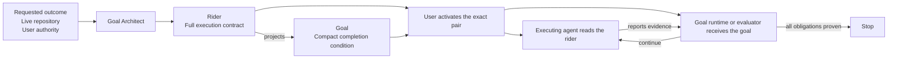

# Goal Architect

Give a long coding run a repository-grounded standard for done.

Goal Architect is a portable skill for Claude Code and Codex. It reads the
requested outcome, the live repository, relevant history, and the user's
authority. It then writes and validates a compact `/goal` plus a detailed rider
for one substantial autonomous coding round.

It authors the contract. It does not implement or activate the work unless the
user asks separately.

## Install

```bash
npx skills@latest add https://github.com/curtis-arch/goal-architect \
  --skill goal-architect
```

Then ask your agent:

```text
Use $goal-architect to create a goal and rider for <your objective>.
```

## Why this exists

An autonomous coding run keeps working until something judges it done. Whatever
the completion condition rewards will receive the agent's attention. A goal
that rewards completed phases and passing tests can produce a great deal of
activity while the requested product remains unfinished.

This kind of drift usually looks like responsible engineering. The feature
gives way to a test framework, mock environment, abstraction, telemetry,
fallback paths, repeated qualification, or process documents. Any one of those
may be necessary. The problem is allowing it to become the objective without
showing which product obligation, material risk, or required proof needs it.

Prompts start work, and plans predict activities and order. The goal/rider pair
defines the result, the proof that can establish it, the authority available to
the agent, and the point where work must stop. It can sit alongside an
implementation plan rather than replacing one.

## One contract, two readers

A long run has two readers with different needs. The goal runtime or evaluator
needs a compact completion condition it can revisit throughout the session. The
executing agent needs the full repository-grounded contract. In Claude Code
goal mode, for example, the stop evaluator sees the goal condition and the
transcript, not the repository.

| Artifact | Reader and job | Contains |
|---|---|---|
| Goal | Gives the runtime and evaluator a stable definition of completion | Product obligations, obligation-to-evidence mappings, material authority, boundaries, and truthful stop conditions in at most 4,000 bytes |
| Rider | Gives the executing agent the detailed contract | Current state, detailed obligations, existing substrate, execution units, proof flows, exclusions, authority, triggered risks, change rules, and completion reporting |

The rider is written first. The goal is its compact evaluator-facing projection.
Both files share one identity and revision and are validated together. A nearby,
older, or unpaired goal cannot silently stand in for the active contract.



## How the contract is built

| Stage | What Goal Architect settles |
|---|---|
| Product criterion | The observable end state the user wants and the concrete current gap. Tests, files, documentation, and process cannot replace it. |
| Repository grounding | Current code, repository instructions, exact prior rider-and-goal pairs, existing environments, and the shortest proof paths already available. |
| Bounded research | Only semantically independent investigations may run in parallel. Workers return cited receipts; one lead resolves conflicts and owns the final pair. |
| Closed contract | `O` IDs name independently judgeable product obligations. `E` IDs name sufficient evidence at the authority each claim requires. `U` IDs name execution units earned by real product, dependency, integration, authority, or proof boundaries. |
| Drift control | New support work must serve an active obligation, a reproduced defect, a material risk, or necessary proof. The agent strengthens existing proof before adding another harness. |
| Validation and handoff | Deterministic checks verify identity, revision, obligation and evidence references, paths, authority labels, citations, and required stop structure before the exact pair is activated. |

The scripts handle stable protocol. One lead agent remains responsible for the
product criterion, final scope, conflicts, evidence design, authority decisions,
and the complete goal/rider prose.

## Feature first, evidence closed

Goal Architect does not optimize for a short rider, small diff, or low test
count. A security change may need a large proof program. A bounded feature may
need one integrated flow. Each addition must be necessary to deliver or prove
the requested product.

Every material obligation maps to named evidence. The evidence level must match
the claim:

- A unit check can establish bounded component behavior.
- An integrated check can establish local product surfaces working together.
- A claim about an actual provider or service needs a real-boundary flow.
- A successful deployment proves that a version was deployed.
- Only a post-deployment product observation proves verified-live behavior.

Separate passing checks do not automatically prove a composed journey. If an
outcome depends on a producer, durable state, transport, consumer, and external
side effect, at least one named evidence flow must cross every material handoff.
A mock remains useful for the bounded claim it can actually prove.

The agent qualifies the result after the final relevant mutation. It repeats
that proof only after another relevant mutation, a required environment change,
an inconclusive result, or discovery of a distinct unproved obligation.

## Designed from observed failures

The controls grew out of a rider-first audit of 12 executed pairs from a
23-pair corpus. Three of the 11 completed rounds contained evidence-anchored
material drift that the operator, rather than the pair, had to catch. The
failures included a telemetry-first start, repeated qualification, and
synthetic proof work that displaced implementation. One run built a large
synthetic test suite and removed it again after the operator redirected the
work back to the feature.

The cost of that pattern scales with the task. It may consume a small part of a
short feature or hours of a long run. Goal Architect does not use a line, test,
or time threshold to identify it. The relevant signal is work that cannot be
tied to the product, a material risk, or proof the product actually needs.

The same audit found large testing and verification programs that were
justified. That is why Goal Architect has no rider, phase, test, file, commit,
agent, or duration target. The number of tests and phases matters less than
whether each one is necessary to deliver or prove the product.

The resulting contract was then used on two unrelated real projects and
reviewed against their complete execution sessions. The reviews exposed gaps in
cross-boundary proof and authority handling. Repeated evidence and a concrete
authority-control defect produced bounded updates; single-run observations
remain candidates. The reviews also produced a useful counterexample: one large
proof program completed without process drift.

One unusual run does not automatically become another skill rule. Retrospective
findings enter an append-only journal. A change is accepted after recurrence or
a failing fixture makes the need concrete. The same admission rule that limits
support work during execution also limits process growth inside Goal Architect.

This history informed the controls. It does not prove that the skill guarantees
an outcome, and the planned controlled comparison has not yet been run.

## Scope and authority stay explicit

The pair records allowed external actions, exact targets, prerequisites,
recovery, and everything still withheld. Permission to deploy one named target
does not imply permission to push Git, mutate another provider, or release an
adjacent service.

After activation, the pair's bytes are immutable. A material scope, authority,
evidence, target, or completion change creates a timestamped superseding pair.
A narrow permission that only unlocks an existing gate can remain in the
execution transcript. This keeps the contract stable without pretending the
world cannot change.

The final report keeps authored, activated, implemented, tested, deployed, and
verified-live as different states. A time or turn bound limits spend; it does
not convert partial delivery into success.

## Provider-neutral contract, provider-aware handoff

The normative pair describes the product rather than one agent harness. Bundled
runtime guidance handles Claude Code and Codex activation, evaluator behavior,
subagent mechanics, compaction, and completion reporting separately.

## What it does not do

- It does not implement the feature or activate the goal without separate user
  authority.
- It is not intended for tiny changes that do not justify a durable contract.
- It does not require fixed phases, red-first tests, documentation work, review
  panels, commits, or parallel agents.
- Its validator checks contract integrity, not whether the product judgment is
  wise. One lead remains accountable for that judgment.

## Verify the package

The installable skill uses the Python standard library. Its self-tests exercise
the shared goal/rider validator and evidence-receipt compiler, including
structural, reference, authority, revision, citation, path, and determinism
failures.

```bash
python3 -B skills/goal-architect/scripts/self_test.py
npx skills@latest add . --list
```

The skills CLI discovers exactly one skill at
[`skills/goal-architect`](skills/goal-architect/).

## License

MIT
